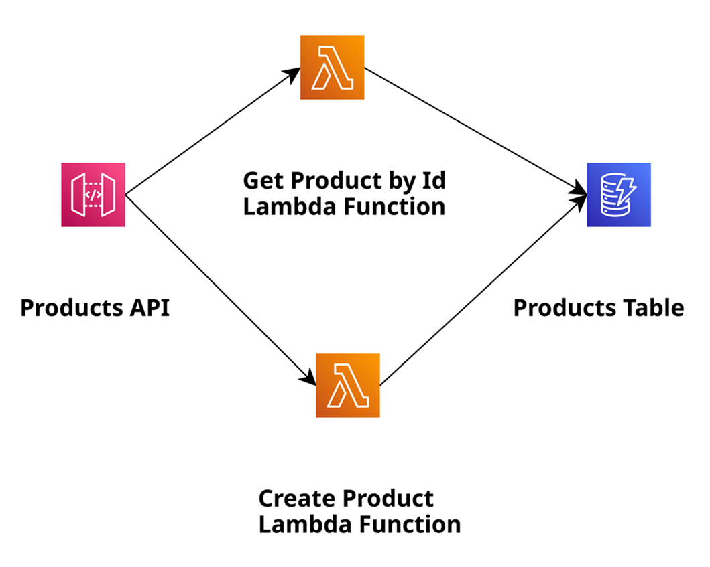

# AWS Lambda Java 25 with DynamoDB as GraalVM Native Image

A serverless REST API built with AWS Lambda using Java 25, compiled as a GraalVM native image for optimal cold start performance and reduced memory footprint. The application provides CRUD operations for products stored in Amazon DynamoDB.

## Architecture

<p align="center">
  
</p>

The application consists of:
- **API Gateway**: REST API endpoint with API key authentication
- **Lambda Functions**: Two handlers compiled as GraalVM native images
  - `CreateProductHandler`: Creates products (POST /products)
  - `GetProductByIdHandler`: Retrieves products by ID (GET /products/{id})
- **DynamoDB Table**: Stores product data with on-demand billing

## Features

- **Java 25**: Uses latest Java features including records
- **GraalVM Native Image**: Fast startup times (~100ms) and low memory usage
- **Custom Runtime**: Uses `provided.al2023` runtime with lambda-runtime-graalvm
- **AWS SDK v2**: Modern AWS SDK for DynamoDB operations
- **Infrastructure as Code**: SAM template for complete deployment
- **API Security**: API key authentication and usage plans

## Project Structure

```
├── src/
│   ├── main/
│   │   ├── java/software/amazonaws/example/product/
│   │   │   ├── handler/
│   │   │   │   ├── CreateProductHandler.java
│   │   │   │   └── GetProductByIdHandler.java
│   │   │   ├── dao/
│   │   │   │   ├── ProductDao.java
│   │   │   │   └── ProductMapper.java
│   │   │   └── entity/
│   │   │       ├── Product.java
│   │   │       └── Products.java
│   │   ├── resources/
│   │   │   └── META-INF/native-image/
│   │   └── reflect-config.json
│   ├── assembly/
│   │   └── native.xml
│   └── shell/native/
│       └── bootstrap
├── pom.xml
└── template.yaml
```

## Prerequisites

- **Java 25 with GraalVM**: Required for native image compilation
- **Maven**: Build tool (version 3.6+)
- **AWS SAM CLI**: For deployment
- **AWS CLI**: Configured with appropriate credentials
- **GCC and development tools**: For native compilation

## Installation

### 1. Install SDKMAN and GraalVM

```bash
curl -s "https://get.sdkman.io" | bash
source "$HOME/.sdkman/bin/sdkman-init.sh"

# Install GraalVM for Java 25
sdk install java 25.0.2-graal
sdk use java 25.0.2-graal
```

### 2. Install Native Image Dependencies

**Amazon Linux 2023 / RHEL / Fedora:**
```bash
sudo dnf install gcc glibc-devel zlib-devel libstdc++-static
```

**Amazon Linux 2 / CentOS:**
```bash
sudo yum install gcc glibc-devel zlib-devel
```

**Ubuntu / Debian:**
```bash
sudo apt-get install build-essential libz-dev zlib1g-dev
```

### 3. Install Maven

```bash
sudo yum install maven
# or
sudo dnf install maven
# or
sudo apt-get install maven
```

## Build

### Set JAVA_HOME

```bash
export JAVA_HOME=$HOME/.sdkman/candidates/java/25.0.2-graal
```

### Compile and Package

```bash
mvn clean package
```

This command will:
1. Compile Java 25 source code
2. Create a shaded JAR with all dependencies
3. Build a GraalVM native image binary
4. Package the native binary with bootstrap script into `function.zip`

The build process takes several minutes due to native image compilation.

## Deploy

### Using AWS SAM

```bash
sam deploy -g --region us-east-1
```

Follow the prompts to configure:
- Stack name
- AWS Region
- Confirm changes before deploy
- Allow SAM CLI IAM role creation
- Save arguments to configuration file

### Subsequent Deployments

```bash
sam deploy
```

## API Usage

After deployment, SAM outputs the API Gateway endpoint URL.

### API Key

The API requires an API key in the `x-api-key` header:
```
x-api-key: a6ZbcDefQW12BN56WEVDDBGVNI25
```

### Create Product

```bash
curl -X POST https://<api-id>.execute-api.us-east-1.amazonaws.com/prod/products \
  -H "x-api-key: a6ZbcDefQW12BN56WEVDDBGVNI25" \
  -H "Content-Type: application/json" \
  -d '{"id": "1", "name": "Print 10x13", "price": 15}'
```

### Get Product by ID

```bash
curl -X GET https://<api-id>.execute-api.us-east-1.amazonaws.com/prod/products/1 \
  -H "x-api-key: a6ZbcDefQW12BN56WEVDDBGVNI25"
```

## Key Dependencies

- **AWS Lambda Java Core**: 1.4.0
- **AWS Lambda Java Events**: 3.16.1
- **AWS SDK for Java v2**: 2.41.27 (DynamoDB)
- **lambda-runtime-graalvm**: 2.6.0 (FormKiQ)
- **Jackson**: 2.21.0
- **SLF4J**: 2.0.17

## Performance Benefits

GraalVM native images provide:
- **Cold start**: ~100-200ms (vs 2-5s for JVM)
- **Memory usage**: ~128-256MB (vs 512MB+ for JVM)
- **Cost savings**: Lower memory and faster execution

## Configuration

### Environment Variables

Set in `template.yaml`:
- `REGION`: AWS region for DynamoDB client
- `PRODUCT_TABLE_NAME`: DynamoDB table name

### DynamoDB Table

- **Table Name**: AWSLambdaJava25AsGVNIProductsTable
- **Partition Key**: PK (String)
- **Billing Mode**: PAY_PER_REQUEST
- **Point-in-time Recovery**: Enabled

## Clean Up

```bash
sam delete
```

## License

This project is licensed under the MIT-0 License.
