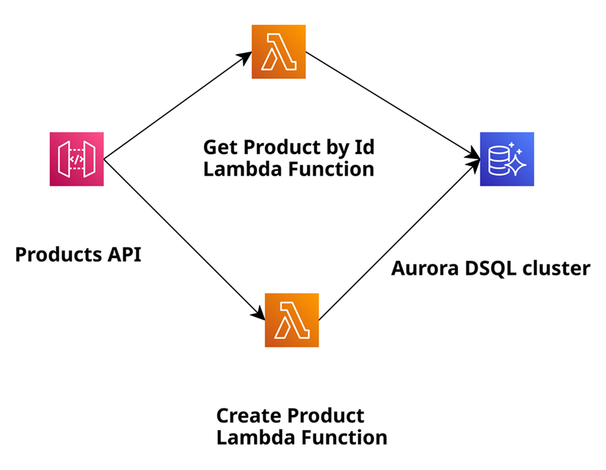

# AWS Lambda Java 25 + Hibernate + Aurora DSQL as GraalVM Native Image

A serverless product catalog API built with Java 25, compiled to a GraalVM Native Image and deployed as an AWS Lambda custom runtime. It uses Hibernate 7 as the ORM, HikariCP for connection pooling, and Amazon Aurora DSQL as the database.

## Architecture

<p align="center">
  
</p>

```
API Gateway (REST) → Lambda (GraalVM Native Image / provided.al2023) → Aurora DSQL (PostgreSQL-compatible)
```

Two Lambda functions are deployed:
- `POST /products` — creates a product (uses a DB sequence for ID generation)
- `GET /products/{id}` — retrieves a product by ID

## Tech Stack

| Component | Technology |
|---|---|
| Language | Java 25 |
| Runtime | GraalVM Native Image (`provided.al2023`) |
| ORM | Hibernate 7.2.4 |
| Connection Pool | HikariCP 7.0.2 |
| Database | Amazon Aurora DSQL (PostgreSQL-compatible) |
| JDBC | Aurora DSQL JDBC Connector 1.4.0 |
| Lambda Runtime Shim | formkiq/lambda-runtime-graalvm 2.6.0 |
| IaC | AWS SAM |

## Project Structure

```
src/main/java/.../product/
├── entity/Product.java          # JPA entity mapped to the `products` table
├── dao/HibernateUtils.java      # Hibernate SessionFactory bootstrap (HikariCP config)
├── dao/ProductDao.java          # Data access: createProduct, getProductById
└── handler/
    ├── CreateProductHandler.java    # POST /products Lambda handler
    └── GetProductByIdHandler.java   # GET /products/{id} Lambda handler
src/main/resources/META-INF/native-image/   # GraalVM reflection/resource configs
src/assembly/native.xml                     # Assembly descriptor for function.zip
template.yaml                               # SAM template (API GW, Lambdas, DSQL cluster)
```

## Prerequisites

- An Amazon Linux 2023 build environment (EC2 or CloudShell) — required for native compilation targeting Lambda
- GraalVM 25 (via SDKMAN)
- Maven
- AWS SAM CLI
- AWS credentials with permissions to deploy Lambda, API Gateway, and Aurora DSQL

## Build & Deploy

### 1. Install GraalVM 25 and Native Image (on Linux)

```bash
curl -s "https://get.sdkman.io" | bash
source "$HOME/.sdkman/bin/sdkman-init.sh"
sdk install java 25.0.2-graal

sudo yum install gcc glibc-devel zlib-devel   
sudo dnf install gcc glibc-devel zlib-devel libstdc++-static  
```

### 2. Clone and build

```bash
git clone https://github.com/Vadym79/aws-lambda-java-25.git
cd aws-lambda-java-25/aws-lambda-java-25-hibernate-aurora-dsql-as-graalvm-native-image

export JAVA_HOME=$HOME/.sdkman/candidates/java/25.0.2-graal
mvn clean package
```

`mvn clean package` does the following in order:
1. Compiles Java 25 sources
2. Creates a fat JAR via `maven-shade-plugin`
3. Compiles the fat JAR to a native binary via `native-maven-plugin` (GraalVM)
4. Packages the binary + `bootstrap` shell script into `target/function.zip` via `maven-assembly-plugin`

### 3. Deploy with AWS SAM

```bash
sam deploy -g --region us-east-1
```

SAM will create:
- Aurora DSQL cluster
- Two Lambda functions (`PostProductJava25WithHibernateAndDSQLAsGVNI`, `GetProductByIdJava25WithHibernateAndDSQLAsGVNI`)
- API Gateway REST API with API key authentication
- CloudWatch Log Groups

## Database Setup

After deployment, connect to the Aurora DSQL cluster (via CloudShell, psql, or the DSQL query editor):

```sql
CREATE TABLE products (id int PRIMARY KEY, name varchar(256) NOT NULL, price int NOT NULL);
CREATE SEQUENCE product_id CACHE 1;
```

Optionally seed some data:

```sql
INSERT INTO products VALUES (1, 'Print 10x13', 15);
INSERT INTO products VALUES (2, 'A5 Book', 5000);
```

See the [Aurora DSQL getting started guide](https://docs.aws.amazon.com/aurora-dsql/latest/userguide/getting-started.html) for connection instructions.

## API Usage

All requests require the API key header: `x-api-key: a6ZbcDefQW12BN56WEHDQGVNI25`

**Create a product**
```bash
curl -X POST https://<api-id>.execute-api.us-east-1.amazonaws.com/prod/products \
  -H "x-api-key: a6ZbcDefQW12BN56WEHDQGVNI25" \
  -H "Content-Type: application/json" \
  -d '{"name": "Print 10x13", "price": 15}'
```

**Get a product by ID**
```bash
curl https://<api-id>.execute-api.us-east-1.amazonaws.com/prod/products/1 \
  -H "x-api-key: a6ZbcDefQW12BN56WEHDQGVNI25"
```

## Key Implementation Notes

- **Connection**: `HibernateUtils` reads `AURORA_DSQL_CLUSTER_ENDPOINT` from the Lambda environment variable (set automatically by SAM from the DSQL cluster resource) and builds a JDBC URL with IAM token-based auth (`token-duration-secs=900`).
- **Bytecode provider**: set to `none` (`Environment.BYTECODE_PROVIDER`) to avoid runtime bytecode generation, which is incompatible with native images.
- **GraalVM configs**: reflection and resource configuration files under `src/main/resources/META-INF/native-image/` cover Hibernate, HikariCP, PostgreSQL driver, and the Aurora DSQL JDBC connector.
- **IAM permissions**: each Lambda function is granted `dsql:DbConnectAdmin` on the DSQL cluster ARN.
